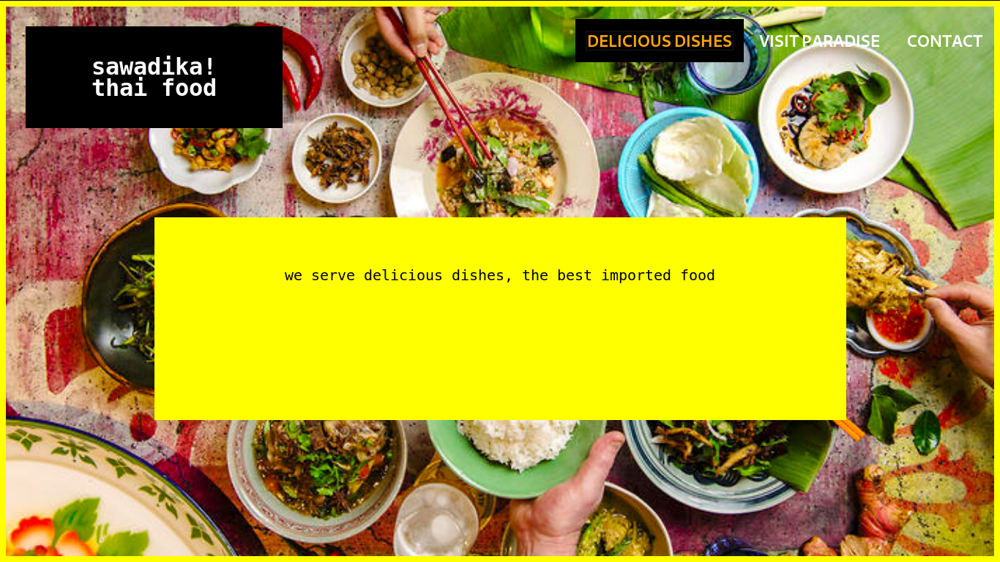

[![Contributors][contributors-shield]][contributors-url]
[![Forks][forks-shield]][forks-url]
[![Stargazers][stars-shield]][stars-url]
[![Issues][issues-shield]][issues-url]
[![MIT License][license-shield]][license-url]

 

  

  <h3 align="center">
    Fancy Restaurant Landing Page
  </h3>

  <h3 align="center">
	 Live Version link - https://alexawesomecode.github.io/project-restaurant-js/
  </h3>

  

   A restaurant page built using only JS.
     

  

## Project Restaurant JS

This project was built only using Javascript for DOM creation and manipulation. Everything, from the content to animations and styling was created inside Js functions.

This is made possible by webpack sourcing three differents files (one for every view) and pushing changes to the DOM through events.

## Snapshot

# Validations

-ESLINT

# Get Started

Download or clone this [repo here](https://github.com/alexawesomecode/project-restaurant-js) and open the 'index.html. file.

# Built With

This project was built with these techologies:

* JAVASCRIPT (extensivily used for DOM manipulation)
* HTML
* WEBPACK
* CSS3

# Authors

**Alejandro Andres**

- Github: [@alexawesomecode](https://github.com/alexawesomecode)
- Twitter: [@alexcode0](https://twitter.com/alexcode0)
- Linkedin: [Alejandro Andres](https://www.linkedin.com/in/alejandro-andres-126592191/)

# License

This project is licensed under the MIT License - see the [LICENSE.md](LICENSE.md) file for details

<!-- ACKNOWLEDGEMENTS -->
## Acknowledgements
* [Microverse](https://www.microverse.org/)
* [The Odin Project](https://www.theodinproject.com/)

<!-- MARKDOWN LINKS & IMAGES -->
<!-- https://www.markdownguide.org/basic-syntax/#reference-style-links -->
[contributors-shield]: https://img.shields.io/github/contributors/alexawesomecode/project-js-tic-tac-toe.svg?style=flat-square
[contributors-url]: https://github.com/alexawesomecode/project-js-tic-tac-toe/graphs/contributors
[forks-shield]: https://img.shields.io/github/forks/alexawesomecode/project-js-tic-tac-toe
[forks-url]: https://github.com/alexawesomecode/project-js-tic-tac-toe/network/members
[stars-shield]: https://img.shields.io/github/stars/alexawesomecode/project-js-tic-tac-toe
[stars-url]: https://github.com/alexawesomecode/project-js-tic-tac-toe/stargazers
[issues-shield]: https://img.shields.io/github/issues/alexawesomecode/project-js-tic-tac-toe
[issues-url]: https://github.com/alexawesomecode/project-js-tic-tac-toe/issues
[license-shield]: https://img.shields.io/github/license/alexawesomecode/project-js-tic-tac-toe
[license-url]: https://github.com/alexawesomecode/project-js-tic-tac-toe/blob/master/LICENSE.txt
